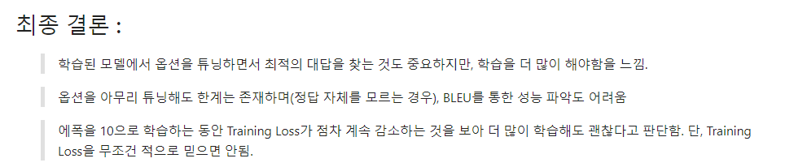

# AIFFEL Campus Online Code Peer Review Templete
- 코더 : 이태훈
- 리뷰어 : 홍서이


# PRT(Peer Review Template)
- [o]  **1. 주어진 문제를 해결하는 완성된 코드가 제출되었나요?**
    - 하이퍼파라미터 튜닝을 진행하였다.
    - BLEU Score로 모델 성능을 지표롤 통해 평가하였다.

    ```python
    for prompt, result, label in zip(list_prompt, list_result, list_data_label):
    #print(result)
    q = prompt[prompt.index('\n')+1:prompt.rindex('\n')]
    print('Q.', q )
    g = result[0]['generated_text'][result[0]['generated_text'].rindex('응답')+5:]
    
    print('G.', g )
    print()
    a = label # 정답
    print('A.', label)
    print()
    print("1-Gram BLEU :", sentence_bleu(a.split(), g.split(), weights=(1, 0, 0, 0 )))  
    print("2-Gram BLEU :", sentence_bleu(a.split(), g.split(), weights=(0, 1, 0 ,0 )))  
    print("3-Gram BLEU :", sentence_bleu(a.split(), g.split(), weights=(0, 0, 1 ,0 )))  
    print("4-Gram BLEU :", sentence_bleu(a.split(), g.split(), weights=(0, 0, 0, 1 ))) 
    print('-'*50)

    ```

    
- [o]  **2. 전체 코드에서 가장 핵심적이거나 가장 복잡하고 이해하기 어려운 부분에 작성된 주석 또는 doc string을 보고 해당 코드가 잘 이해되었나요?**
    - generator를 통해 text를 생성하는 과정에서 하이퍼파라미터 튜닝을 수행하고 각 파라미터에 대한 주석을 작성하였다.

    ```Python
    generation_args = dict(
    num_beams=1,                   # 하나의 빔만 사용
    repetition_penalty=2.0,         # 답변 중복을 피하기 위한 패널티 설정
    no_repeat_ngram_size=1,         # 중복되는 n-gram 금지
    eos_token_id=375,               # 문장 종료 토큰 설정 (모델에 맞게 수정)
    max_new_tokens=64,              # 생성할 최대 토큰 수 설정
    do_sample=False,                # 샘플링 
    top_k=150,                      # 상위 k개 후보 중에서 선택
    top_p=0.9,                      # 누클레어스 샘플링 확률 설정
    early_stopping=False,            # 생성 중단 설정
    temperature=1.0,               # 온도 설정 (더 낮게 설정하면 더 확실한 답변)
    )
    ```
  
- [o]  **3. 에러가 난 부분을 디버깅하여 문제를 “해결한 기록을 남겼거나 새로운 시도 또는 추가 실험을 수행”해봤나요?**
    - 하이퍼파라미터 튜닝을 수행하면서 모델 성능에 한계를 느꼈고 이를 해결하기위한 방법으로 학습을 더 많이해야 한다고 결론을 내렸다.

- [o]  **4. 회고를 잘 작성했나요?**
    - 회고를 통해 모델 훈련 결과를 정리하고 프로젝트를 진행하면서 배운 점들을 기록하였다.
    


- [o]  **5. 코드가 간결하고 효율적인가요?**
    - 코드를 함수화하여 코드 중복을 최소화하고 범용적으로 사용할 수 있도록 하였다.

    ```Python
    @dataclass
    class DataCollatorForSupervisedDataset(object): 

    tokenizer: transformers.PreTrainedTokenizer

    def __call__(self, instances: Sequence[Dict]) -> Dict[str, torch.Tensor]:
        input_ids, labels = tuple([instance[key] for instance in instances] for key in ("input_ids", "labels"))
        input_ids = torch.nn.utils.rnn.pad_sequence(
            input_ids, batch_first=True, padding_value=self.tokenizer.pad_token_id
        )
        labels = torch.nn.utils.rnn.pad_sequence(labels, batch_first=True, padding_value= -100)
        return dict(
            input_ids=input_ids,
            labels=labels,
            attention_mask=input_ids.ne(self.tokenizer.pad_token_id),
        )
    ```

# 참고 링크 및 코드 개선
- [koChatGPT 링크](https://github.com/airobotlab/KoChatGPT)